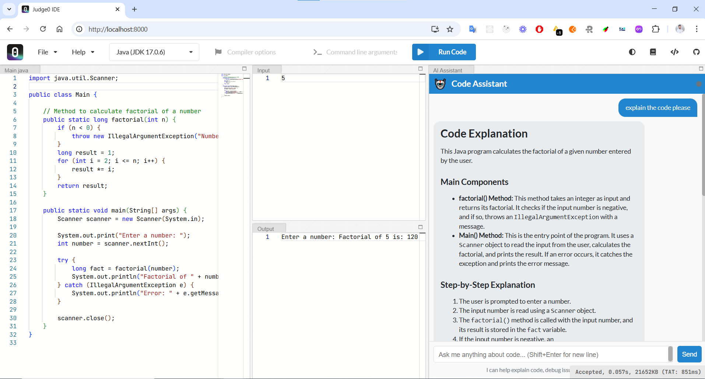
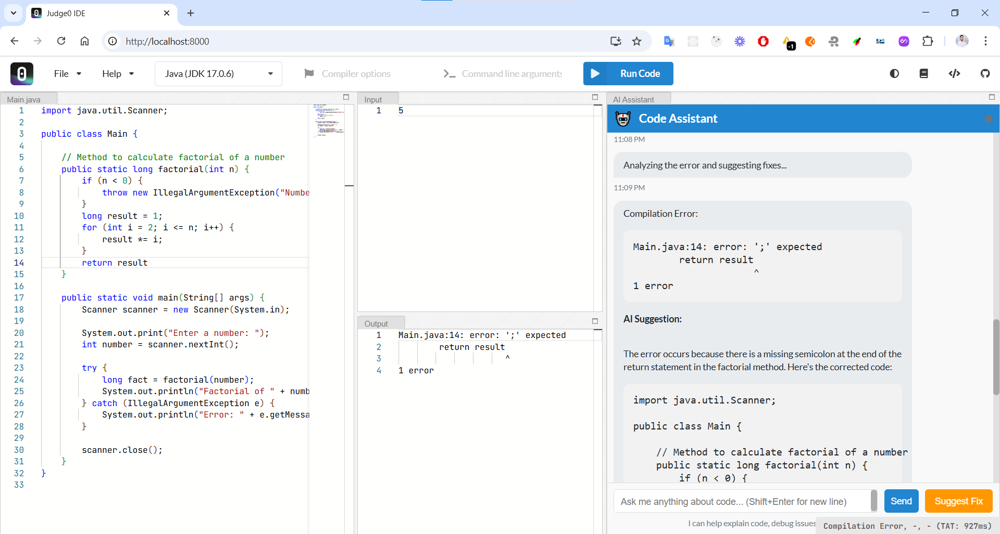
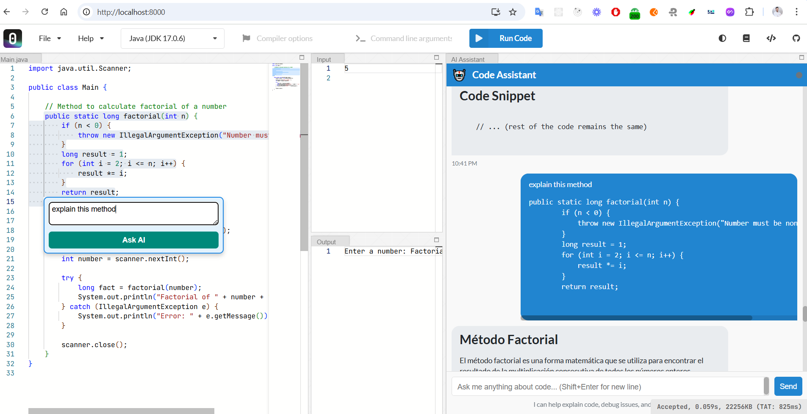

# AI Assistant for Judge0 IDE

This repository adds **AI features** to the existing [Judge0 IDE](https://github.com/judge0/ide). The new capabilities include:

1. **AI Chat Panel**:  
   Ask code-related questions or discuss debugging strategies directly in an integrated chat interface.

2. **Suggest Fix**:  
   If your code doesn’t compile, the AI can analyze the compiler error and suggest ways to fix it.

3. **Code-Selection Widget**:  
   Highlight any portion of your code, then instantly **Ask AI** about it—e.g., get clarifications or improvements.

---

## AI-Specific Features

### AI Chat Panel
- Appears on the right side of the IDE layout.
- Type any question (e.g., “How does this algorithm work?”) and **Send** to receive an AI-generated response.
- The assistant’s replies appear in a **chat** format, all within the IDE.

### Suggest Fix
- When a compilation error is detected, a **Suggest Fix** button becomes visible.
- Clicking it prompts the AI to analyze the **error output** and propose a fix or explanation.

### Code-Selection Widget
- Highlight a snippet of code in the **Source Editor**.
- A small floating **“Ask AI”** box appears, allowing you to enter a specific question about that snippet.
- The AI’s response is displayed within the main chat panel, ensuring a unified conversation flow.

---

## Configuration

- In **`ai.js`**, set your **AI endpoint** (`AI_ENDPOINT`), **API key** (`AI_API_KEY`), and possibly **model** (e.g., GPT, LLaMA).
- Ensure your AI service can handle the code context and return well-structured responses.

---

Enjoy exploring the **AI-enhanced** capabilities of Judge0 IDE!

## 🖼️ Screenshots

